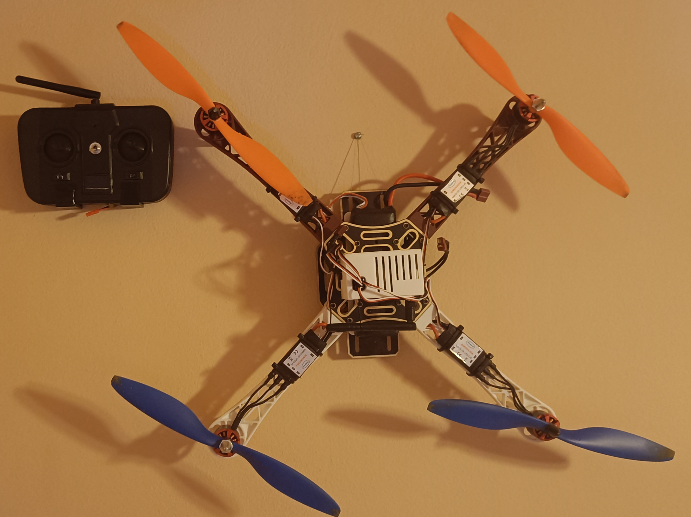

# Arduino Flight Controller for Drone

## Overview

This Arduino flight controller is designed for controlling a drone using an ESP32 microcontroller, various sensors, and PID control loops. It utilizes an NRF24L01 radio module for communication with a remote control, and Bluetooth for parameter tuning. The flight controller reads data from sensors, calculates PID outputs, and controls four motors accordingly.

If you're interested in this project, visit my [Instagram](https://www.instagram.com/pan.string/) where I've made a few videos about the making process.

## Hardware Requirements

- ESP32 microcontroller
- NRF24L01 radio module
- BME280 barometric pressure sensor
- HMC5883 magnetometer
- 4x BLDC motors
- 4x 30A ESC
- DJI F450 frame
- Battery

## Libraries Used

- Wire.h
- SPI.h
- RF24.h
- BME280I2C.h
- Adafruit_Sensor.h
- Adafruit_HMC5883_U.h
- ESP32Servo.h
- BluetoothSerial.h
- EEPROM.h

## Tasks and Functions

- `InitInput()`: Initializes all the required components and sets up motor pins.
- `ReadSensors()`: Reads sensor data and updates pitch, roll, yaw, and altitude inputs.
- `CalculatePID()`: Implements PID control to calculate motor outputs based on sensor inputs and setpoints.
- `GetRadio()`: Reads remote control inputs via NRF24L01 and updates setpoints.
- `Bluetooth()`: Listens for Bluetooth commands to adjust PID parameters.
- `ControlMotors()`: Controls the four motors based on PID outputs.
- `GetRadioTaskFunction()`: Task function for parallel execution, handling radio communication and Bluetooth.

## Error Handling

If the drone exceeds pitch or roll angles of ±45 degrees, a flight error is triggered.

## Notes

- The flight controller is set up for a quadcopter configuration.
- Radio and Bluetooth communication are handled in parallel using FreeRTOS tasks.

## Future Improvements

- Implement altitude hold using barometric pressure sensor.
- Fine-tune PID parameters for optimal performance.
- Enhance error handling and implement failsafe mechanisms.

## Disclaimer

This code is a basic example, and adjustments may be needed for specific drone configurations. Use it at your own risk.

